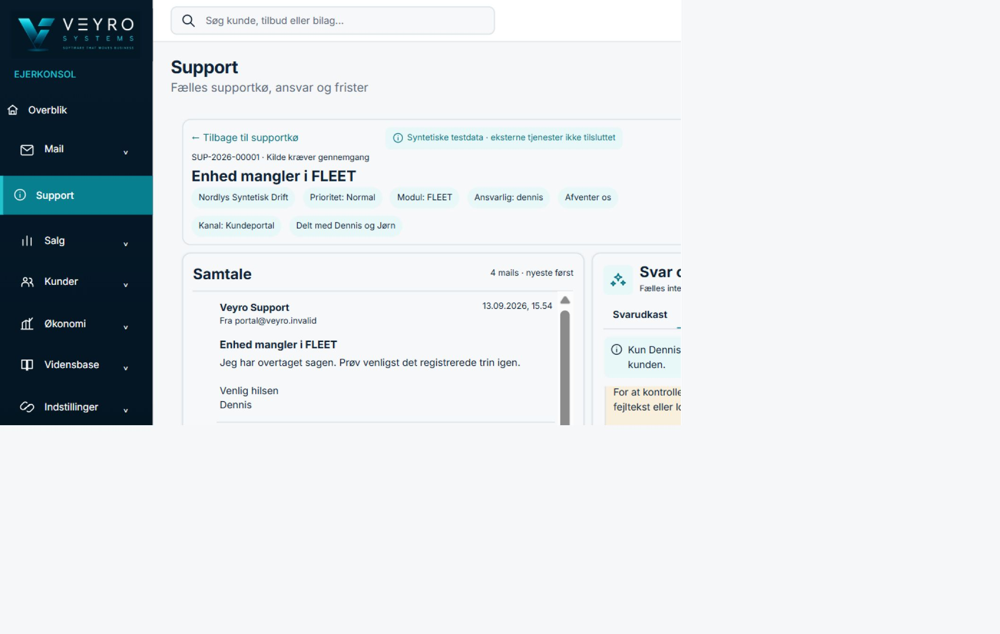
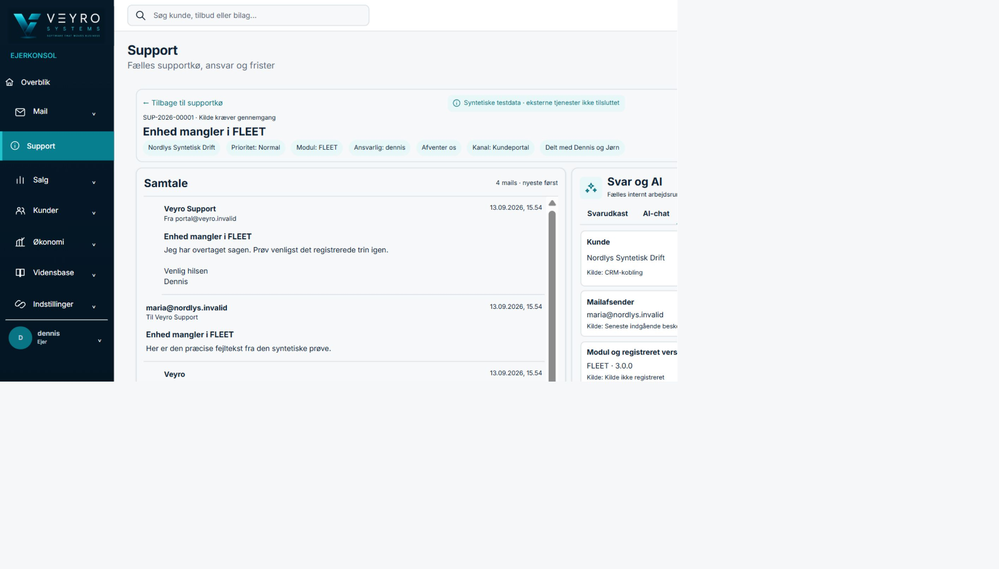
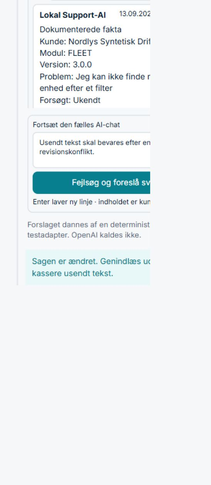

# Veyro Ejerkonsol — integrationsoverlevering V1

Dato: 13. september 2026

## Checkpoints og afgrænsning

- Ejerworktree: `C:\Users\DennisChristensen\Documents\GitHub\Fleet_V3-ejer-integrated`
- Branch: `codex/ejer-integrated-development`
- Bevaret ejerudgangspunkt: `7fa23cdd7f189e9adec8e56fb36168ad2d547fc3`
- Permanent ejeradapter: `f7325ea94044a577a9660b323270f965ae4ac8a7`
- Fælles supportprodukt: `aa269edc0e757ff6b5c2f2beddd628c643057c71`
- Fælles supportdokumentation og afprøvet backend: `aae761d18e8835cc2c572316068f8f51e50aaee8`
- Kontrakt: `veyro.support.v1.1`
- Emulatorprojekt: `demo-veyro-support-samling`
- Lokale porte: Auth `9198`, Realtime Database `9290`, Functions `5099`

De fire aftalte supportdokumenter blev læst skrivebeskyttet fra
`aae761d18e8835cc2c572316068f8f51e50aaee8`. Supportsporets kildekode, Rules,
Functions og autoritative `support/`-model er ikke ændret. Der er ikke udført
merge, push, deployment, eksternt AI-kald, rigtig mailafsendelse eller anden
ekstern transport.

Denne overlevering samler den eksisterende Ejerkonsol gennem V8.1, den særskilte
mobilrettelse og den permanente portaladapter. Tidligere funktionsbeviser er
fortsat dokumenteret i `docs/VEYRO_EJERKONSOL_REVIEW_V8_1_SUPPORT_AI.md` og
`docs/VEYRO_EJERKONSOL_REVIEW_V8_1_MOBIL_AI_HISTORIK.md`.

## Resultat

Ejerkonsollens Support og Mail kan nu bruge den fælles V1.1-sag direkte. En
portalprojektion vælges kun, når `traad.kilde.adapter` er
`veyro.support.v1.1`. `sagId` og `traadId` er samme id, og adapteren opretter
ingen redigerbar kopi under `udbyder/salgsindbakke/traade`.

De tidligere blokerede interne handlinger er permanent mappet:

| Ejerhandling | Fælles callable | Revisions- og sikkerhedsbinding |
| --- | --- | --- |
| Kø og sag | `supportEjerKoelist`, `supportEjerSagHent` | Serverberegnet projektion; ingen parallel sagsmodel. |
| Overtag/status/note | `supportEjerOvertag`, `supportEjerStatusOpdater`, `supportEjerNoteSkriv` | Stabilt `anmodningId`; forventet revision hvor kontrakten kræver det. |
| Intern AI | `supportEjerAiForslagGem` | Sagsrevision, AI-revision, aktivitet, kladderevision og kladdefingeraftryk. |
| Intern baggrund | `supportEjerBaggrundGem` | Sagsrevision og oplysningsrevision. |
| Kundekladde | `supportEjerSvarKladdeGem` | Kanal `portal`, præcis sags- og kladderevision. |
| Godkendelse | `supportEjerSvarGodkend` | Binder præcis kladderevision. |
| Transport | `supportEjerSvarTransporter` | Legacy `supportEjerSvarSend` anvendes aldrig. |

Automatiske gentagelser kan genbruge samme `anmodningId` via
`anmodningId`/`operationId`. `aborted` genindlæser servergrundlaget uden at
nulstille usendt kladde- eller AI-tekst. `permission-denied` fejler lukket.
Interne noter, intern AI, intern baggrund og interne kilder forbliver adskilt fra
kundesvaret.

Den isolerede supportemulator indeholder med vilje ikke ejerens private
mailendpoints. `hentPlatform` henter derfor portalprojektionen uafhængigt af den
private mailkilde. Manglende private endpoints skjules ikke: adapterstatus
angiver dem særskilt, mens den fælles Support-sag fortsat kan åbnes og
behandles.

## Fælles filændringer i ejersporet

- `.env.owner-emulator.example`: dokumenterer konfigurerbare Auth-, Database-
  og Functions-porte.
- `src/firebase.js`: validerer og bruger de tre lokale emulatorporte; standarder
  er uændrede (`9099`, `9000`, `5001`). Localhost-, `demo-*`- og previewværn er
  bevaret.
- `src/fleet/ejer-support-kontrakt.js`: fælles payloadbyggere og stabil
  idempotens for intern AI og baggrund.
- `src/fleet/ejer-support-adapter.js`: permanent V1.1-mapping, normalisering og
  uafhængig portalindlæsning.
- `src/moduler/udbyder/EjerMailV71Samtale.jsx`: sender både sagsrevision og det
  interne arbejdsrums revision.
- `test/ejer-support-ai.test.mjs` og
  `test/firebase-emulator-guard.test.mjs`: kontrakt-, payload- og portværn.

Ingen fælles serverfil, Rule eller fil i et andet modulworktree er ændret.

## Faktisk sammenhængende browserprøve

Prøven blev udført gennem ejerens byggede brugerflade på
`http://127.0.0.1:5215` mod supportcheckpoint
`aae761d18e8835cc2c572316068f8f51e50aaee8`.

1. Normalt login som syntetisk tenantløs ejer blev gennemført.
2. Den kanoniske sag `-P1Q20URMCth2sShxsA6` / `SUP-2026-00001` blev hentet fra
   `supportEjerKoelist` og `supportEjerSagHent`.
3. Sagen blev overtaget i ejerfladen.
4. Intern AI blev kørt og gemt via `supportEjerAiForslagGem`; arbejdsrummet har
   fire chatindlæg og revision 2.
5. Intern baggrund blev gemt via `supportEjerBaggrundGem`.
6. En samtidig baggrundsændring hævede sagsrevisionen fra 11 til 12. Det næste
   AI-kald blev afvist med `aborted`; den usendte tekst stod fortsat i feltet
   efter adapterens genindlæsning.
7. Previewserveren blev stoppet, genbygget og startet igen. Efter nyt normalt
   login og en eksplicit browsergenindlæsning stod sagsnummer, samtale,
   kundekladde og gemte interne data fortsat i brugerfladen.
8. Databasekontrollen viste `kontraktVersion: veyro.support.v1.1`,
   `sag.id === sag.traadId`, revision 12 og ingen parallel salgstråd på samme id.

Al anvendt kunde-, person-, mail- og sagsdata er syntetisk.

## Mobilrettelsen og browsermålinger

Den fungerende V8.1-mobilgeometri er bevaret. AI-historikken ruller uafhængigt
over den faste komposer, og usendt tekst overlever faneskift, genindlæsning ved
konflikt og responsive skift.

| Mål | Faktisk CSS-viewport | Synlig AI-historik | Indhold | Scroll | Resultat |
| --- | --- | ---: | ---: | ---: | --- |
| 360×800 | 359×800 | 240 px | 1.954 px | 0 → 1.714 px muligt | Flere hele linjer, komposer synlig, usendt tekst bevaret. |
| 390×844 | 389×843 | 281 px | 1.893 px | afprøvet til 1.612 px | Kendt svar, kilder, begrænsning og næste spørgsmål kan læses og rulles frem. |
| 1440×900 | 1440×900 | 141 px i den målte konflikttilstand | 1.488 px | afprøvet til 1.348 px | `aborted` vist; usendt tekst bevaret. |
| 1920×1080 | 1919×1080 | Oplysningsvisning | 2 kilder | — | Intern baggrund og kildeadskillelse vist. |

In-app-browserens viewportskalering har en dokumenteret kalibreringsgrænse på
én CSS-pixel ved 360, 390 og 1920 pixels. PNG-eksporten har desuden sin egen
outputskalering; filnavnene angiver derfor den afprøvede målviewport, mens de
rå CSS-målinger er autoritative og ligger ved billederne.

Den faktiske beregnede font var `Inter Variable, Inter, -apple-system, Segoe UI,
Roboto, Arial, sans-serif`. Ved desktop var brødtekst `14px` med `20.3px`
linjehøjde; ved den målte mobile AI-historik `12px` med `17.4px` linjehøjde.

## Testresultater

| Kontrol | Resultat |
| --- | --- |
| Ejer-, mail-, support-, adgangs-, design- og emulatorværnstests | **44/44 bestået** |
| Fælles supportkontrakttests på supportcheckpointet | **11/11 bestået** |
| Målrettet ESLint på alle syv ændrede filer | **Bestået, 0 fejl** |
| Vite produktionsbuild | **Bestået, 540 moduler** |
| `git diff --check` før implementeringscommit | **Bestået** |
| Tenantløst login, overtagelse, intern AI, baggrund, konflikt og reload | **Bestået i faktisk ejer-UI** |
| Ekstern AI, mail, filtransport og deployment | **Ikke kaldt** |

Det brede `npm run lint` kan ikke initialisere, fordi den eksisterende
`facility-v2/eslint.config.js` importerer den ikke-installerede pakke
`@eslint/js`. Fejlen opstår før lint af ejerfilerne og er ikke indført af denne
ændring. Den målrettede ejer-lint er ren.

## Browserbeviser

- `docs/screenshots/ejer-integrationshandoff-v1/1440x900-revisionskonflikt-usendt-ai.png`
- `docs/screenshots/ejer-integrationshandoff-v1/1920x1080-oplysninger-og-kilder.png`
- `docs/screenshots/ejer-integrationshandoff-v1/360x800-ai-historik-og-usendt-tekst.png`
- `docs/screenshots/ejer-integrationshandoff-v1/390x844-ai-historik-og-usendt-tekst.png`
- `docs/screenshots/ejer-integrationshandoff-v1/390x844-ai-historik-rullet.png`
- `docs/screenshots/ejer-integrationshandoff-v1/1910x1074-genindlaest-portaldata.png`

Rå browsermålinger og eksportdimensioner findes i samme mappe og i
`manifest.json`.

## Integrationsafhængigheder og resterende begrænsninger

1. Support-/integrationssporet ejer fortsat de autoritative callables, Rules,
   kontraktdokumenter og `support/`-data. Ejeradapteren må ikke selv udvide
   modellen.
2. Den fælles prøvebackend indeholder ikke ejerens øvrige CRM-, økonomi- og
   private mailendpoints. De øvrige ejerflader er bevaret, men denne komposite
   emulator verificerer specifikt Support V1.1.
3. Microsoft 365, OpenAI, Dinero, OCR og bilagsmail er fortsat **Ikke
   tilsluttet**. Den lokale Support-AI er deterministisk og syntetisk.
4. En rigtig portaltransport, ekstern mail og ekstern AI kræver særskilt
   credentials, konfiguration, godkendelse og produktionsverifikation. Intet af
   dette er aktiveret her.
5. Fysisk mobilt skærmtastatur er fortsat en manuel resttest; responsive
   viewportmål, faktisk scroll og tekstbevarelse er browserafprøvet.
6. Workspace-lint kræver, at den eksisterende `facility-v2`-afhængighed
   `@eslint/js` bringes i orden af det relevante modulspor.

## Lokal gennemgang

Mens den isolerede backend og previewserveren kører:

- Login: `http://127.0.0.1:5215/login`
- Supportkø: `http://127.0.0.1:5215/main/support`
- Afprøvet sag:
  `http://127.0.0.1:5215/main/support?sag=-P1Q20URMCth2sShxsA6`

Navigér **Support → SUP-2026-00001 → Svar og AI**. Fanerne er
**Svarudkast**, **AI-chat** og **Oplysninger**. Den bevarede usendte tekst ses i
AI-chatten, og den gemte interne baggrund samt kildeadskillelsen ses under
Oplysninger.
