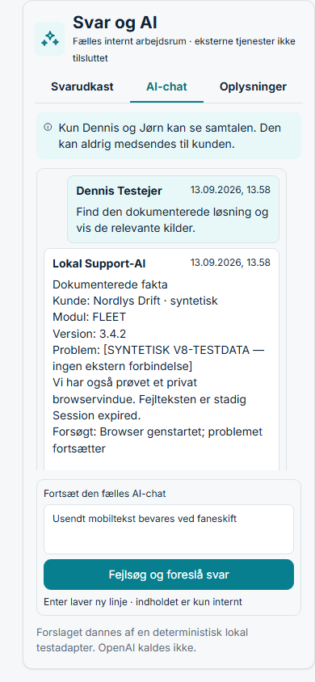
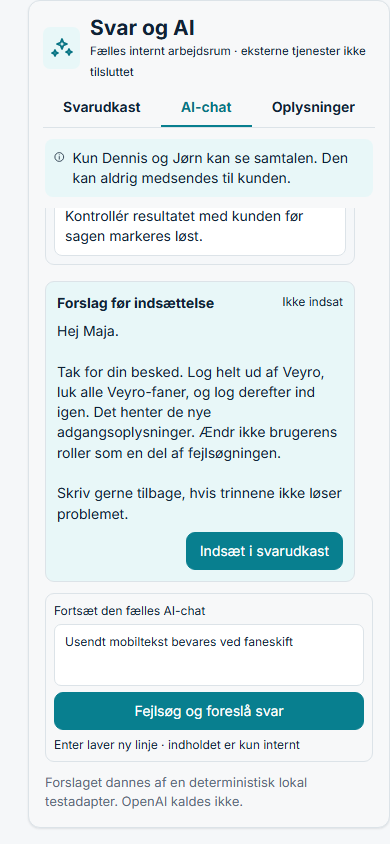
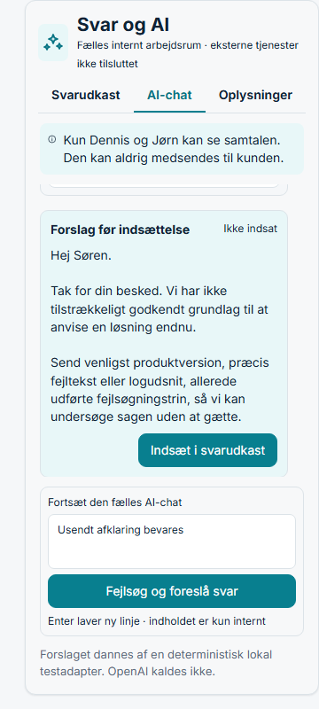

# V8.1 – mobil læseplads i Support-AI

Dato: 13. september 2026. Lokal og syntetisk prøve; ingen push, deployment,
ekstern AI eller mailafsendelse.

## Afgrænsning

Denne rettelse ændrer kun mobilgeometrien i ejerkonsollens eksisterende
Support-arbejdsrum. Portalens interne AI- og oplysningshandlinger er ikke
koblet til en lokal parallelmodel. De forbliver lukket, indtil samlingschatten
leverer den fælles kontrakt og de integrationsejede endpoints.

## Rettelse

- Supportens `Svar og AI`-panel bruger på mobil en hel mobilviewport med en
  nedre grænse på 700 px.
- AI-historikken har mindst 240 px reel læseplads og fortsat sin egen scroll.
- Komposeren er gjort mere kompakt, men ligger stadig i sin egen nederste
  gridrække og er ikke en del af historikkens scroll.
- React-state for den usendte tekst er uændret. Faneskift mellem AI-chat,
  Oplysninger og Svarudkast nulstiller ikke teksten.

## Faktiske browsermålinger

| Viewport | AI-panel | Historik, synlig | Historik, indhold | Scrollafstand | Beregnet linjekapacitet |
| --- | ---: | ---: | ---: | ---: | ---: |
| 390×844 | 685 px | 374 px | 1.017 px | 643 px | 18,42 linjer |
| 360×800 | 641 px | 330 px | 996 px | 666 px | 16,26 linjer |

Ved begge størrelser var `overflow-y: auto`, komposeren var synlig, og der var
ingen vandret dokumentoverflow. Scroll blev udført fra `0 → 643` ved 390×844
og til `666` ved 360×800.

Den usendte tekst blev skrevet, der blev skiftet væk fra og tilbage til
AI-chatten, og værdien var fortsat til stede i begge prøver.

## Indholdsbeviser

- Kendt problem viser det dokumenterede spørgsmål og et læsbart svar med
  registrerede fakta. Efter scroll vises den kundegodkendte vejledning om at
  logge helt ud, lukke Veyro-faner og logge ind igen.
- Ukendt problem viser ingen opfundet løsning. Det læsbare svar beder om
  produktversion, præcis fejltekst eller logudsnit samt allerede udførte
  fejlsøgningstrin.

Rå målinger findes i
`docs/screenshots/ejer-review-v8-1-mobile-ai-history/measurements.json`.

## Verifikation

- `node --test test/ejer-support-ai.test.mjs`: 8/8 bestået.
- Målrettet ESLint: bestået.
- `npm run test:design`: 11/11 bestået.
- `npm run build`: bestået, 540 moduler transformeret.
- Syntetisk browserprøve: bestået ved 390×844 og 360×800.

## Afhængighed til samlingschatten

Ansvarsgrænsen fra
`docs/VEYRO_EJER_SUPPORT_KONTRAKT_INPUT_V1_1.md` er uændret. Når den fælles
kontrakt udvides med interne portal-AI-/oplysningsoperationer, skal
`ejer-support-adapter.js` tilpasses til netop disse integrationsejede
endpoints. Indtil da fejler portalhandlingerne lukket; den eksisterende lokale
mail-/supportmodel må ikke bruges som en skjult kopi.
